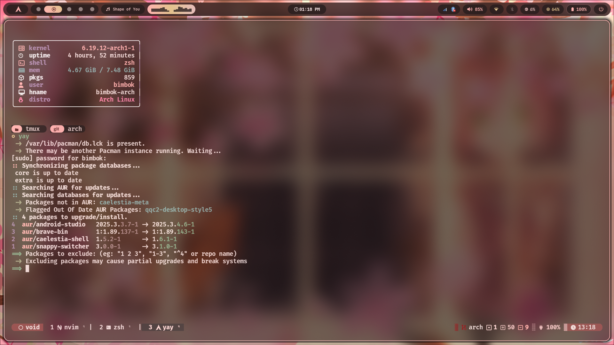
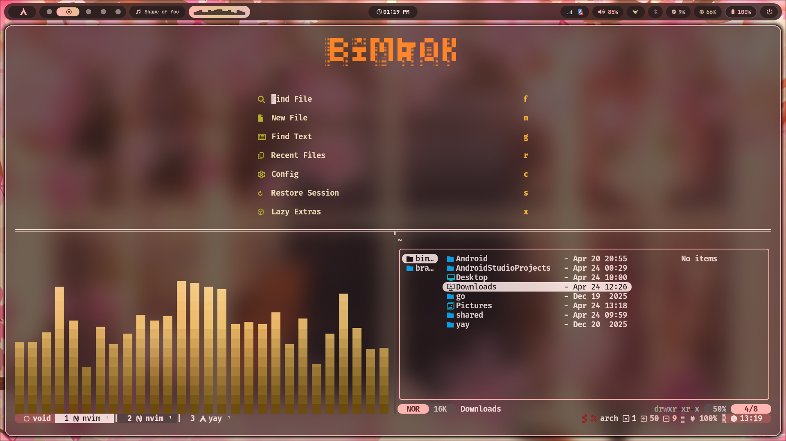
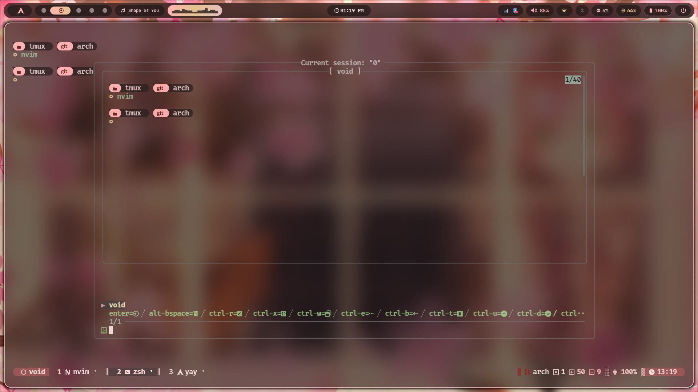
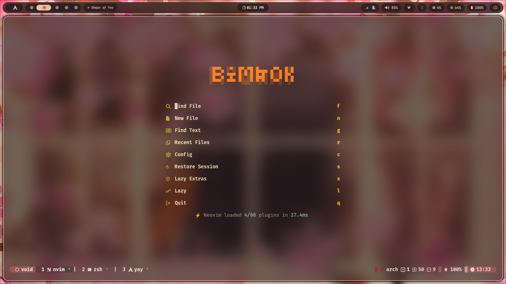

# Bimbok Tmux Config

Opinionated `tmux` setup with a custom status theme, fast navigation, popup/session helpers, and local screenshots that match the current config.

## Screenshots

## What This Config Does

### Core tmux behavior

- Uses `tmux-256color` and enables truecolor for `xterm*` and `xterm-kitty`.
- Enables mouse support.
- Sets `status-interval` to `2` seconds.
- Keeps `50000` lines of scrollback history.
- Sets `escape-time` to `0` for faster key handling.
- Turns on automatic window renaming and window renumbering.
- Places the status bar at the bottom.
- Enables focus events.
- Starts windows and panes at index `1`.
- Uses `/bin/zsh` as the default shell.
- Watches background windows for bell and activity events and shows visual alerts.
- Enables terminal passthrough support.
- Preserves `TERM` and `TERM_PROGRAM` in the tmux environment.
- Lets you reload the config with `Prefix + r`.

### Navigation and pane workflow

- Changes the prefix key to `Ctrl + Space`.
- Supports pane movement with `Alt + h/j/k/l`.
- Supports pane movement with `Alt + Arrow` keys.
- Switches windows with `Shift + Left/Right`.
- Switches windows with `Alt + H/L`.
- Jumps directly to windows `1` through `9` with `Alt + 1..9`.
- Splits panes in the current pane directory with `Prefix + "` and `Prefix + %`.
- Swaps windows left and right with repeatable `Prefix + <` and `Prefix + >`.

### Copy mode

- Uses vi keys in copy mode.
- `v` starts selection.
- `Ctrl + v` toggles rectangle selection.
- `y` copies the selection and exits copy mode.
- `tmux-yank` is enabled for clipboard-friendly yanking.

### Plugin-backed features

- `tmux-plugins/tpm` for plugin management.
- `tmux-plugins/tmux-censible` for sensible tmux defaults.
- `christoomey/vim-tmux-navigator` for Vim/tmux navigation integration.
- `tmux-plugins/tmux-yank` for easier copy/yank behavior.
- `omerxx/tmux-sessionx` bound to `Prefix + o`.
- `azorng/tmux-smooth-scroll` with `quad` easing and mouse scrolling enabled.
- `jtmcginty/tmux-session-dots` for session indicators.
- `joshmedeski/tmux-nerd-font-window-name` for Nerd Font-based window naming.
- `omerxx/tmux-floax` with menu bound to `Prefix + P`.
- `wfxr/tmux-fzf-url#legacy` for fzf URL picking.

### Floax popup settings

- Popup size is `80%` width by `80%` height.
- Changes to the current pane path before opening.
- Uses the session name `floax-terminal`.
- Uses the title `floax`.
- Sets border color to `magenta` and text color to `blue`.

### SessionX settings

- Bound to `Prefix + o`.
- Popup size is `75%` width by `85%` height.
- Uses `zoxide` mode.
- Keeps the current session visible in the picker.
- Enables previews.

## Custom Theme

The status line is driven by [`bimbok-theme/theme.tmux`](bimbok-theme/theme.tmux) and the scripts in [`bimbok-theme/src/`](bimbok-theme/src).

### Theme behavior

- Uses a nice Gruvbox Dark theme with support for "medium" and "hard" variants.
- Uses a transparent background because `@gruvbox-tmux_transparent` is set to `1`.
- Uses `arabic` formatting for window IDs.
- Uses `super` formatting for pane IDs.
- Uses `dsquare` formatting for zoomed pane IDs.
- Uses double pane borders and shows pane borders in the status area.
- Highlights the active pane border in bold purple.

### Left status

- Shows a rounded left segment.
- Shows a different icon when the tmux prefix is active.
- Displays the current session name.

### Window tabs

- Shows a different icon when the active pane is running `ssh`.
- Shows custom formatted window numbers.
- Shows pane IDs for normal windows.
- Shows a zoom indicator when a window is zoomed.
- Uses a `|` separator between windows.

### Right status widgets

- Git widget from [`git-status.sh`](bimbok-theme/src/git-status.sh):
  - current branch
  - changed file count
  - insertion count
  - deletion count
  - untracked file count
  - clean / dirty / ahead / remote-diff status icon
- Workboard widget from [`wb-git-status.sh`](bimbok-theme/src/wb-git-status.sh):
  - GitHub or GitLab provider icon
  - pull request / merge request count
  - review request count
  - assigned issue count
  - assigned bug count
- Battery widget from [`battery-widget.sh`](bimbok-theme/src/battery-widget.sh):
  - battery percentage
  - charging/discharging/full state icon
  - low battery threshold set to `25`
  - battery device set to `BAT0`
- Time widget from [`datetime-widget.sh`](bimbok-theme/src/datetime-widget.sh):
  - 24-hour time by default
  - hidden only if `@gruvbox-tmux_show_time` is explicitly set to `0`

## Keymaps

Full keymap table: [`KEYMAPS.md`](KEYMAPS.md)

Important bindings:

- `Ctrl + Space`: tmux prefix
- `Prefix + r`: reload config
- `Alt + h/j/k/l`: move between panes
- `Alt + Left/Right/Up/Down`: move between panes
- `Shift + Left/Right`: previous/next window
- `Alt + H/L`: previous/next window
- `Alt + 1..9`: jump to window number
- `Prefix + "`: horizontal split in current directory
- `Prefix + %`: vertical split in current directory
- `Prefix + <` / `Prefix + >`: move window left/right
- `Prefix + o`: SessionX popup
- `Prefix + P`: Floax menu

## Requirements

- `tmux`
- `zsh`
- [TPM](https://github.com/tmux-plugins/tpm)
- A Nerd Font for the icons used by the theme and window names
- `git`
- `bc`
- `awk`, `grep`, `sed`, `stat`
- `jq` if you want the GitHub workboard widget
- `gh` for GitHub workboard data
- `glab` for GitLab workboard data
- `zoxide` for the configured SessionX mode

## Install

1. Clone or copy this repo to `~/.config/tmux`.
2. Install TPM at `~/.tmux/plugins/tpm`.
3. Start tmux.
4. Press `Ctrl + Space`, then `Shift + I` to install plugins.
5. Reload with `Ctrl + Space`, then `r`.

## Notes

- The README only documents features that are present in the current `tmux.conf` and custom theme scripts.
- The screenshots above replace the old remote image embed and now use the local files in `Sample/`.
- The git widget script expects `bimbok-theme/lib/coreutils-compat.sh`; if that helper is missing in your local setup, that widget may need a small fix.
